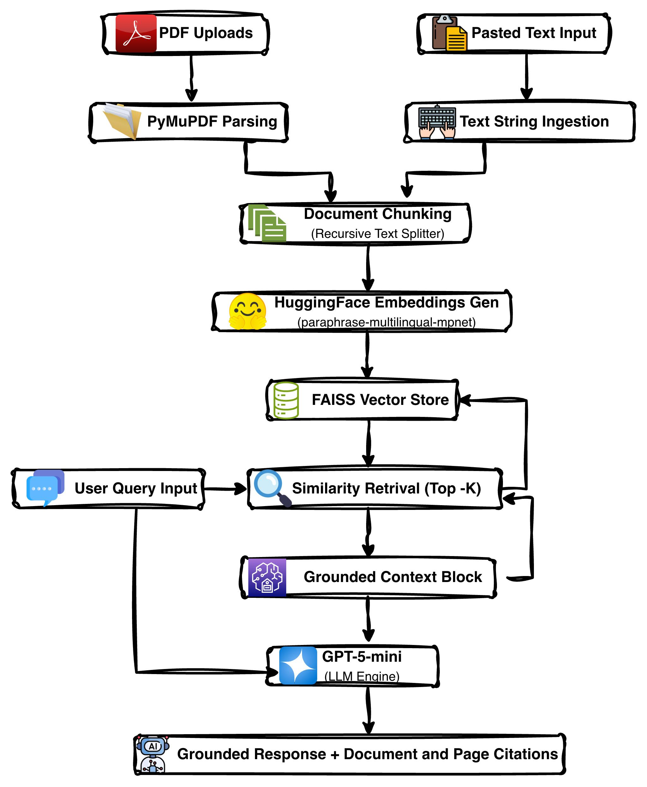
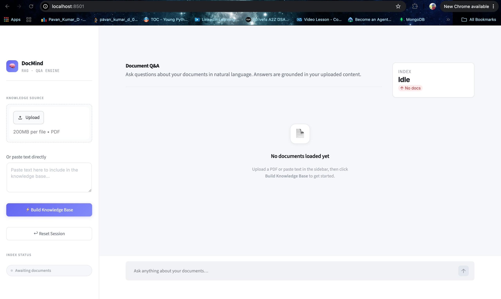
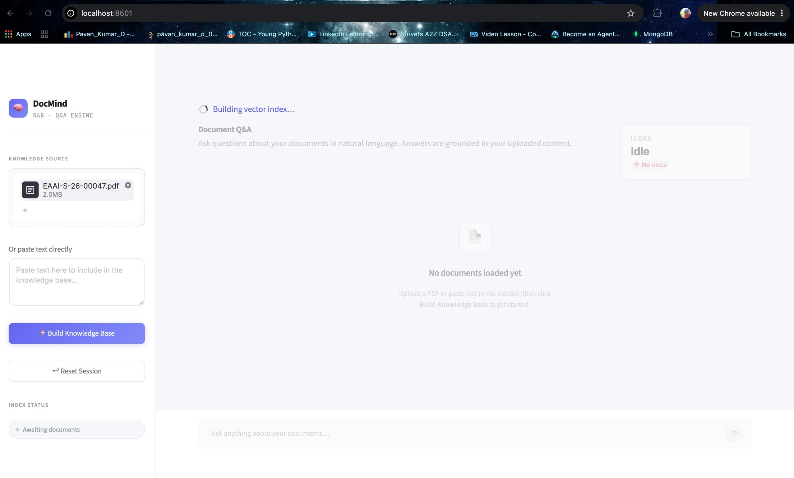
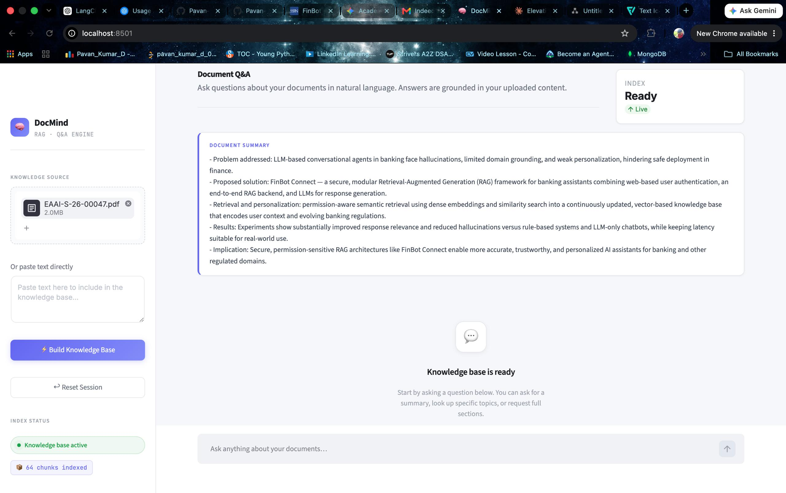
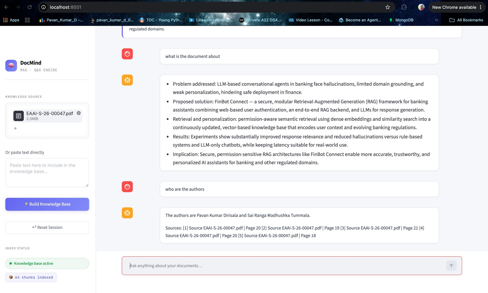

# 📄 DocMind : A Context-Aware Document Q&A Bot

A high-performance Retrieval-Augmented Generation (RAG) based document intelligence system that enables users to upload complex PDF documents or paste unstructured text, facilitating natural language questioning grounded strictly within the provided content.

---

## 🛠️ Built With


---

## 🚀 Problem Statement

Searching manually through voluminous, multi-page corporate documents, research journals, and text blocks to isolate specific data points is highly inefficient. 

This project solves this challenge by implementing an isolated, secure **Context-Aware Document Q&A Engine** optimized to:
* **Ingest & Parse:** Efficiently tokenize multi-source document inputs.
* **Semantic Retrieval:** Execute fast vector similarity queries across localized text segments.
* **Prevent Hallucinations:** Constrain LLM synthesis strictly to the context window boundaries of retrieved chunks.
* **Audit & Verify:** Generate explicit source-attribution maps featuring exact file origins and page numbers.

---

## ✨ Features

### 📂 Document Processing Engine
* **Hybrid Data Ingestion:** Concurrent handling of multi-file PDF uploads alongside live text clipboard pasting.
* **Granular Chunking:** Text fragmentation that ensures content continuity while maintaining small chunk sizes.
* **Metadata Tracking:** Permanent downstream alignment mapping content text to original metadata attributes (`source`, `page_number`).

### 🧠 Advanced RAG Pipeline
* **Local Embeddings Vectorization:** Leverages the open-source `paraphrase-multilingual-mpnet-base-v2` transformer model for local semantic vector generation without external API overhead.
* **In-Memory Vector Search:** Leverages `FAISS` index mapping for sub-millisecond distance-similarity calculations.
* **Grounded Answer Synthesis:** Connects context matrices directly to `GPT-5-mini` using optimized strict-grounding system prompt blueprints.

### 🖥️ Enterprise UI/UX
* **Conversational Feed:** Streamlit-powered messaging grid mimicking a native modern chat interface.
* **One-Click Session Management:** Complete dynamic state flushing (`st.session_state` cache clearing) via modular sidebar controls.
* **Instant Dynamic Overview:** Automated text summary extraction utilizing the top leading chunks of your indexed knowledge base.

---

## 🏗️ System Architecture




---

## 📂 Project Structure

```text
azentrix-fullstack-task1/
│
├── app.py                      # Main Streamlit Dashboard Application UI Layout
│
├── rag/                        # Modular RAG Architecture Core Directory
│   ├── chunker.py              # Text fragmentation and sliding window manager
│   ├── document_loader.py      # Abstract interface parsing unified data assets
│   ├── embeddings.py           # Local HuggingFace transformer encoder layer
│   ├── knowledge_loader.py     # Ingestion orchestration coordinator
│   ├── llm_answer.py           # Generation invocation loop routing
│   ├── llm_initializer.py      # OpenAI client interface orchestrator 
│   ├── pdf_loader.py           # PyMuPDF (fitz) streaming extraction layer
│   ├── prompts.py              # Strict system grounding prompt matrices
│   ├── retriver.py             # Similarity search index retrieval filter
│   ├── text_loader.py          # Plaintext string parsing adapter
│   └── vector_store.py         # FAISS vector management matrix
│
├── requirements.txt            # System dependencies manifest
├── .env                        # Local execution secrets vault
└── README.md                   # System documentation documentation

```

---

## ⚙️ Installation & Setup

### 1. Clone the Repository

```bash
git clone [https://github.com/your-username/azentrix-fullstack-task1.git](https://github.com/your-username/azentrix-fullstack-task1.git)
cd azentrix-fullstack-task1

```

### 2. Configure Environment Isolation

**On Windows:**

```bash
python -m venv venv
venv\Scripts\activate

```

**On macOS / Linux:**

```bash
python3 -m venv venv
source venv/bin/activate

```

### 3. Install Core Framework Dependencies

```bash
pip install -r requirements.txt

```

### 4. Inject Environment Configuration

Create a `.env` file within the system root directory and input your access credentials:

```env
OPENAI_API_KEY=your_openai_api_key_here

```

### 5. Launch the Web Application

```bash
streamlit run app.py

```

---

## 🧠 Technical Implementation Approach

* **Step 1: Ingestion Pipeline:** Documents are converted into memory-efficient document dictionaries containing raw text fragments paired with physical source arrays.
* **Step 2: Token Windowing:** Text streams are broken down into small, overlapping chunks to keep the context window highly accurate.
* **Step 3: Embeddings Mapping:** `sentence-transformers/paraphrase-multilingual-mpnet-base-v2` translates text chunks into dense 768-dimensional vector spaces, optimizing structural similarity tracking with zero runtime lookup costs.
* **Step 4: FAISS Storage:** Multi-dimensional matrix arrays are cached locally in memory for low-latency distance calculations during search queries.
* **Step 5: Context Assembly:** The user's query is vectorized to isolate the top 5 most relevant matching chunks, forming a dense context block.
* **Step 6: LLM Reasoning:** The generated context is passed to `GPT-5-mini` using strict system constraints to block external knowledge access, ensuring responses are completely deterministic and free of hallucinations.

---

## 📸 Interface Preview

### 1. Initial Dashboard State

The application launches with an empty knowledge base, allowing users to upload PDF documents or provide custom text input before creating the retrieval index.

 

---

### 2. Knowledge Base Construction & Document Summary

After document ingestion, the system extracts content, generates embeddings, builds the FAISS vector index, and automatically produces a concise document summary for quick understanding.



---

### 3. Semantic Retrieval & Question Answering

Users can interact with the uploaded documents using natural language. The system performs semantic retrieval over the indexed knowledge base and generates context-grounded responses using GPT-5-mini.



---

### 4. Source Attribution & Explainability

Every response is accompanied by document-level and page-level citations, enabling users to verify the origin of the generated information and maintain transparency.




## 👨‍💻 Author

**Pavan Kumar Dirisala** *B.Tech in Computer Science & Engineering — KL University* 🚀 **Aspiring Generative AI & Machine Learning Engineer** 
* **GitHub:** [@Pavan-Kumar-Dirisala](https://github.com/Pavan-Kumar-Dirisala)

* **LinkedIn:** [Pavan Kumar Dirisala](https://linkedin.com/in/your-profile)